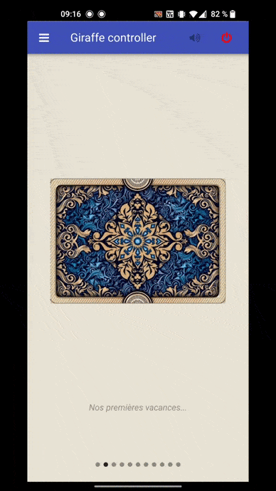

# Giraffe project

Connected giraffe using 3D printing, electronic and software.

## 3D Printing

This part describe printing / 3D. All parts has been printed with my personnal Creality CR-10 with [this filament](https://www.filimprimante3d.fr/filament-pla-mat/2497-filament-pla-mat-blanc-calcaire-175-mm-1kg.html).

### Giraffe model

Giraffe model came from [thingiverse](https://www.thingiverse.com/thing:182149).

### Basement

Basement has been developped with fusion 360.

## Hardware 

Hardware is based on ESP32 module.

### Music

 - [DFPLAYER mini](https://www.amazon.fr/gp/product/B07911V1NL/ref=ppx_yo_dt_b_asin_title_o09_s00?ie=UTF8&psc=1)
 - [3W speaker](https://www.amazon.fr/gp/product/B073XH8KK8/ref=ppx_yo_dt_b_asin_title_o09_s00?ie=UTF8&psc=1)

### Led

 - [WS2812B](https://www.amazon.fr/gp/product/B01CDTE9AW/ref=ppx_yo_dt_b_asin_title_o09_s01?ie=UTF8&psc=1) led strip

## ESP32

This part descibe arduino software for ESP32.

### Change partition management of ESP32

1 - You need to change partition management in file $ARDUINO_DIRECTORY/hardware/espressif/esp32/tools/partitions/default.csv to :

``` csv
# Name,   Type, SubType, Offset,  Size, Flags
nvs,      data, nvs,     0x9000,  0x5000,
otadata,  data, ota,     0xe000,  0x2000,
app0,     app,  ota_0,   0x10000, 0x1F0000,
app1,     app,  ota_1,   0x200000,0x200000,

```
Due to bluetooth stack size. [See this issue](https://github.com/espressif/arduino-esp32/issues/1075)

2 - Update maximum application flash size in file $ARDUINO_DIRECTORY/hardware/espressif/esp32/board.txt at line 12 according previous step:

```
esp32.upload.maximum_size=2031616
```

### Libraries

For this project I used two major libraries:
 - [DFRobotDFPlayerMini](https://github.com/DFRobot/DFRobotDFPlayerMini)
 - [NeoPixelBus](https://github.com/Makuna/NeoPixelBus)

## Android APP

. 

Android app has been developped with QT using c++ and qml.
The app interact with the esp32 using BLE. When you flip a card, it starts playing a song which match with the picture.

## Integration

I'm using insert with screws to fix the electronic board in the casing.
. 
